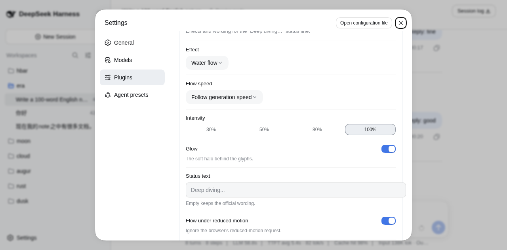
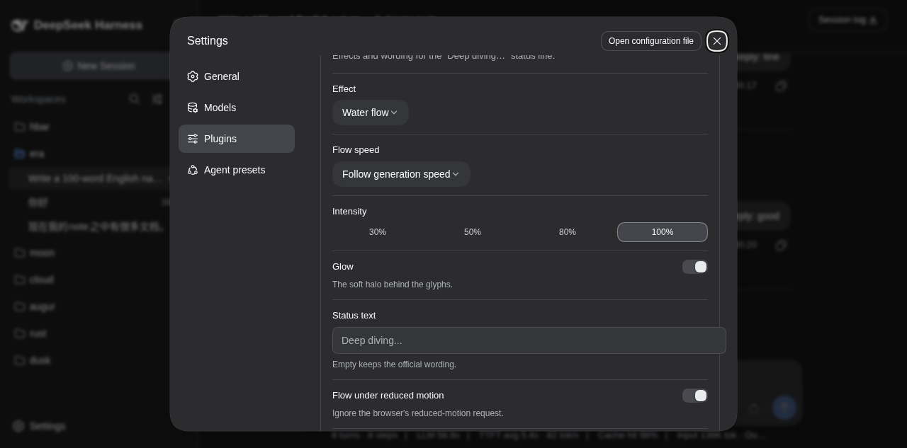

# dsh-ui-deepdiving

Curated effects and wording for the [DeepSeek Harness](https://github.com/deepseek-ai/deepseek-harness) (dsh) web "Deep diving…" turn status — six pure-CSS flowing-light presets (water flow, stock sweep, breath, rainbow, pulse, aurora), custom status wording, and a speed that follows the generation itself.

为 dsh web 端的 "Deep diving…" 运行状态条提供动效与文字定制——六种纯 CSS 流光预设（水流、原版扫光、呼吸辉光、虹彩流转、电波掠过、极光缓摆）、自定义状态文字，以及跟随生成速度的流动节奏。

---

## Why

The stock effect is a single pale band sweeping a flat-blue text every 1.8s — between sweeps the label is static, so the water stops. This plugin keeps the glyphs under a permanent current: three parallax gradient layers flow left→right like a river — a broad slow color undulation as the bed, medium highlight waves over it, and fast narrow sparkle streaks on the surface.

原版效果是一条淡色光带每 1.8s 扫过一次静态蓝字——两次扫过之间文字是静止的，"水"会停下来。本插件让文字永远处于水流之中：三层视差渐变从左向右流动——底层是宽幅缓慢的色浪河床，中层是斜切高光波浪，表层是快速掠过的窄亮流光。

| Stock 原版 | Deepdiving 本插件 |
|:---:|:---:|
| single band, mostly flat | three parallax currents, never stops |

Close-up — the water-flow on "Deep diving…", one complete 6s cycle compressed to 2.4s. APNG with full 8-bit alpha: transparent background (reads correctly on light and dark GitHub themes), smooth glyph edges, and the 25%-opacity glow intact. A 1-bit-alpha `demo.gif` sits alongside for GIF-only consumers. Full stock-vs-flow comparison with a live theme toggle in the [standalone demo](docs/demo.html):


Since 0.0.1 the card rides the official plugin-settings path (dsh `0.1.0-rc.7`, [cookbook](https://github.com/deepseek-ai/deepseek-harness/blob/master/docs/cookbook/adding-a-settings-card.md)): the host half registers the `deepdiving` settings namespace, the browser half claims its keyed slot, and the tab pairs the two halves automatically. Animation verified live on dsh `0.1.0-rc.6` (stock hashed class `Md3f7G_turnStatus`, GLM turn running): the plugin's animation, layers, and dark-theme brightening all resolve on the real element. 动画已在 dsh `0.1.0-rc.6` 真实会话中验证（原版哈希类名、GLM 思考中）：动画、分层、暗色提亮均在真实元素上生效。

## Effects 动效

Six pure-CSS presets, switched live from the settings card (no reload):

| Effect | Visual | Knob |
|:---|:---|:---|
| **Water flow 水流** (default) | three parallax currents over a color river bed | — |
| **Stock sweep 原版扫光** | the official single-band sweep, kept as a fallback | — |
| **Breathing glow 呼吸辉光** | the whole row breathes in place | depth 呼吸深度 |
| **Rainbow shimmer 虹彩流转** | the water currents plus an alternating hue swing | span 色相跨度 |
| **Pulse sweep 脉冲掠过** | one narrow bright beam with a wide halo sweeping by | halo 光晕宽度 |
| **Aurora sway 极光缓摆** | a broad diagonal curtain swinging slowly | sway 摆动幅度 |

Shared knobs: **intensity 强度** (30–100%, pulls the two lightest highlight stops toward transparency — the bed stays opaque and the text readable) and **glow 流动辉光** (the soft aura behind the glyphs). Each effect declares a duration floor honored in both speed modes, so follow mode can never jitter aurora or over-drive breath.

Adding an effect is one registry entry: the stylesheet is generated once from the `EFFECTS` table (lib/client.js), the picker flips `body[data-dv-effect]`, and per-effect knobs project as `--dv-*` custom properties — no CSS re-injection at runtime.

## Install

```sh
dsh plugin --profile web add dsh-ui-deepdiving
# or: dsh plugin --profile web add github:iluluyu/dsh-ui-deepdiving
```

Restart `dsh web` and reload. Uninstall: `dsh plugin --profile web remove dsh-ui-deepdiving`.

重启 `dsh web` 并刷新浏览器即可。卸载：`dsh plugin --profile web remove dsh-ui-deepdiving`。

## Speed alignment

Measured from chat.deepseek.com's production stylesheet, the official thinking shimmer is `2s ease-out infinite` — one 70%-white band sweeping two text widths (`translate(-100%)→(100%)`, 10% tail pause), with a perceived mid-sweep pace of ~1.5 text widths/s. This plugin's constant default is **4s**, at which the mid layer moves at exactly 1.50w/s — the official cadence — while the sparkle layer reads as surface ripples and the bed layer as slower depth. Follow mode anchors ~50 tok/s (the typical API turn) onto that same 4s cadence and climbs a log curve to a 2s rapids ceiling at ~250 tok/s — Cerebras-class serving reads at twice the official pace, never beyond.

## Performance

Pure CSS: zero JS per frame, zero layout. Measured via CDP `Performance.getMetrics` over a 4s window with the animation running: Script 0.003s, Layout 0.000s, RecalcStyle 0.044s, total Task 0.164s ≈ **2.4% of one core at 60fps**, repainting only the 26px status row (`contain: layout paint` fences the damage region; the glow radius is 12px to bound raster cost).

## Design

- **Pure CSS**, no JS animation loop; layered on the `background-clip: text` the stock rule already sets.
- Every gradient is periodic and every layer travels an exact integer number of tiles per cycle → **seamless loop** (6s default).
- Selector `[role="status"][class$="_turnStatus"]` beats the CSS-module hashed class (e.g. `Md3f7G_turnStatus`) in specificity and tolerates hash changes between builds.
- Colors resolve from the host's `--dsw-static-deepseek-*` tokens with official fallbacks; `body[data-ds-dark-theme]` (the ThemePresenter signal) brightens the river bed for dark surfaces.
- `prefers-reduced-motion` → static, still-colorful gradient.
- **Custom wording** rides the DOM: a `data-dv-text` attribute becomes `::before { content: attr(data-dv-text) }` while the stock text node collapses to `font-size: 0`. React diffs only its own vdom and never reclaims attributes it does not manage, so the wording survives the per-second elapsed-tick re-renders; a 1s watchdog re-pins it after per-turn remounts; the gradient clipping and the glow shadow inherit onto the pseudo-element, so every effect animates the custom wording identically.

纯 CSS 实现，直接叠在官方已设置的 `background-clip: text` 上；每层渐变均为周期函数且每循环位移整数个 tile，无缝循环；选择器特异性高于 CSS module 哈希类且容忍构建哈希变化；颜色实时读取宿主官方 token；暗色主题与减少动态效果均已适配。

### Reduced motion & the force-flow setting

`prefers-reduced-motion: reduce` (Windows: Settings → Accessibility → Visual effects → Animation effects off; macOS: Reduce motion) would hold the currents still — the same guard the stock dsh shimmer has. Since most reduced-motion users still want this gentle effect, **force-flow is ON by default**: the flow animates regardless, and anyone who needs true stillness (e.g. vestibular sensitivity) flips it off once in

**Plugins → dsh-ui-deepdiving** (or **Settings → Plugins → Deep diving** on dsh ≤ 0.1.5)

| Light | Dark |
|:---:|:---:|
|  |  |

The card follows the official plugin-card chrome (same tokens, fold-out layout, bilingual zh/en copy tracking the app locale) and holds:

- **Effect 动效** — the preset picker (official Menu dropdown); defaults to water flow.
- **Flow speed 流动速度** — `Constant` or `Follow generation speed` (official Menu dropdown, theme-aware). Defaults to **follow**: the water breathes with the turn itself.
- **Speed multiplier 速度倍速** — a segmented scale of official Pill chips (3× · 2.5× · 2× · 1.5× · 1× · 0.5×, edge to edge across the field), shown in constant mode only — in follow mode the pace belongs to the token stream. **1× is the official shimmer cadence**; 3× triples it (1.3s), 0.5× halves it (8s). Defaults to 1×.
- **Intensity 强度** — 30% / 50% / 80% / 100% pills, applied live to the highlight layers.
- **Glow 辉光** — the text-shadow halo switch, default ON.
- **Status text 状态文字** — custom wording for the status line, defaulting to **“Deep Diving”** (the plugin's own name); an explicitly empty input keeps the official locale text ("Deep diving..." / "深度求索中..."). Input commits debounced (300ms); applied per turn via a `data-dv-text` attribute React never reclaims (see Design).
- **Per-effect knobs 效果微调** — the selected effect's own segmented scale (depth / span / halo / sway); unselected effects keep their saved values.
- In follow mode a MutationObserver over the conversation flow maps the streamed character pace onto `--dv-dur`. Calibrated to measured throughputs: **~50 tok/s (the typical API turn — Zhipu GLM, DeepSeek) lands exactly on the official cadence at 1×**; faster providers climb a log curve to a rapids ceiling at ~250 tok/s (Cerebras-class serving); still water is 12s. 
- **Flow under reduced motion** — the force-flow toggle, default ON; applies live (no reload).

Preferences persist in the host's settings document (`settings.yaml`) through the official plugin-settings mechanism — the host half registers the `deepdiving` namespace (schemastery schema), and every card write is a revision-fenced `settings.mutate` over the wire, so they follow the user across browsers and machines. A `Reset to defaults 恢复默认` action appears whenever the user layer holds any key; leftover localStorage values from the unpublished 0.3.x/0.4.x predecessors migrate automatically on first load. (On dsh `0.1.0-rc.6` and earlier, the api-proxy allowlist kept third-party namespaces off the wire, so those dsh builds stay on localStorage — the readers remain as a fallback.)

### Tunables

| Variable | Default | Meaning |
|:---|:---|:---|
| `--dv-dur` | `4s` | loop length (1× cadence; follow mode projects 12s→2s, clamped per effect) |
| `--dv-int` | `1` | highlight intensity (0.3–1); color-mixes the two lightest stops toward transparency |
| `--dv-glow` | `0 0 12px rgb(103 158 254 / 0.25)` | aura behind glyphs; `none` to disable |
| `--dv-depth` / `--dv-span` / `--dv-trail` / `--dv-swing` | `0.35` / `90deg` / `15%` / `-30%` | breath depth · rainbow hue span · ecg halo · aurora sway |

```css
:root { --dv-dur: 2s; --dv-glow: none; }  /* faster, no aura */
```

## Demo

Open [`docs/demo.html`](docs/demo.html) directly in a browser — a standalone comparison page (light/dark, stock vs flow), no dsh required. `?strip=36&bg=white|black` renders phase-frozen filmstrips; [`docs/make-gif.py`](docs/make-gif.py) mates the two backdrops into the transparent GIF (two-background alpha recovery, since GIF alpha is 1-bit).

浏览器直接打开 [`docs/demo.html`](docs/demo.html) 即可查看对比演示（明暗主题 × 原版/流动），无需运行 dsh。

## Development

Zero-build: `lib/client.js` is hand-maintained source AND the shipped artifact, in the `window.__ModuleLoader__` handoff format (see the [outline plugin](https://github.com/iluluyu/dsh-ui-outline) for the same skeleton). `npm run check` syntax-checks; `npm publish` ships.

Settings: the official plugin-settings path — host-side `deepdiving` namespace + `plugins.bundle.config` / `plugins.row.config` (dsh ≥ 0.1.6) and keyed `settings.plugin.item` card (dsh ≤ 0.1.5) + `settingsScope` revision-fenced reads/writes (plan and research live in [docs/MIGRATION-settings-card.md](docs/MIGRATION-settings-card.md) and [docs/slot-compatibility-migration.md](docs/slot-compatibility-migration.md)).

```sh
git clone https://github.com/iluluyu/dsh-ui-deepdiving
npm run check
```

MIT © iluluyu
